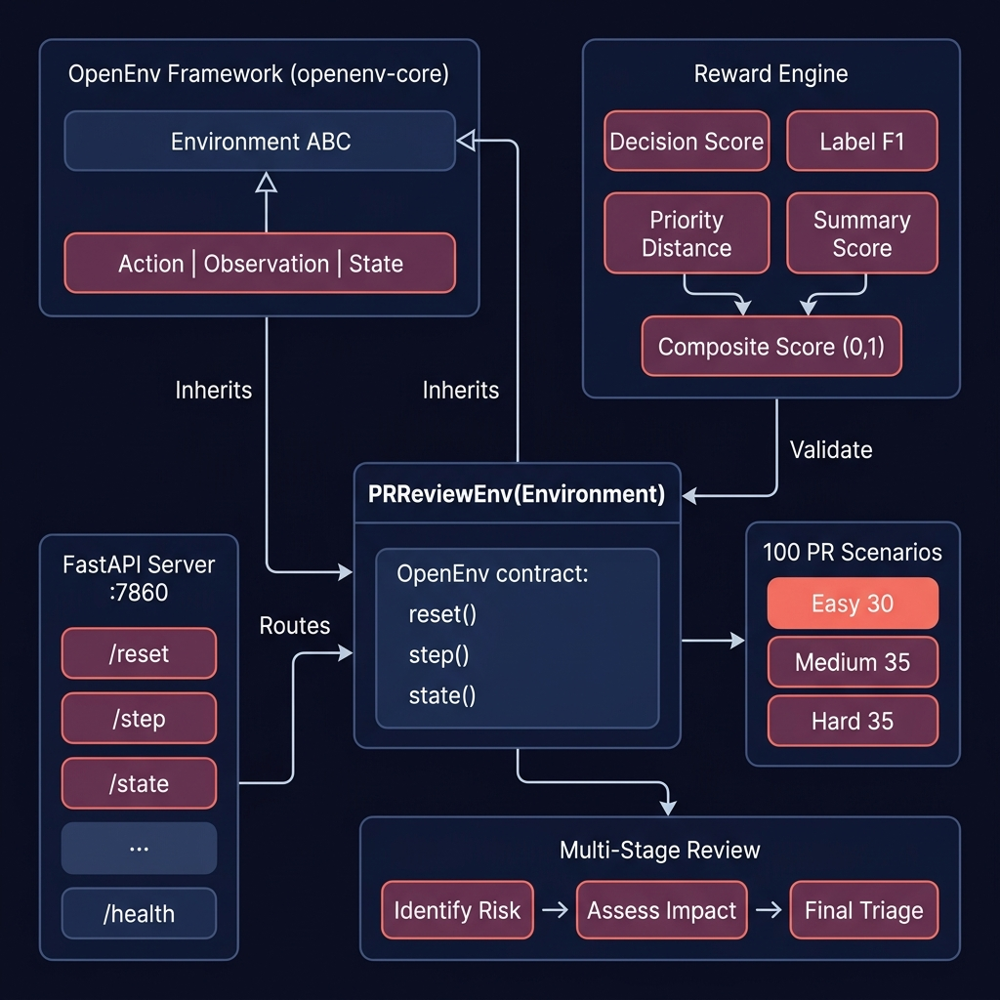
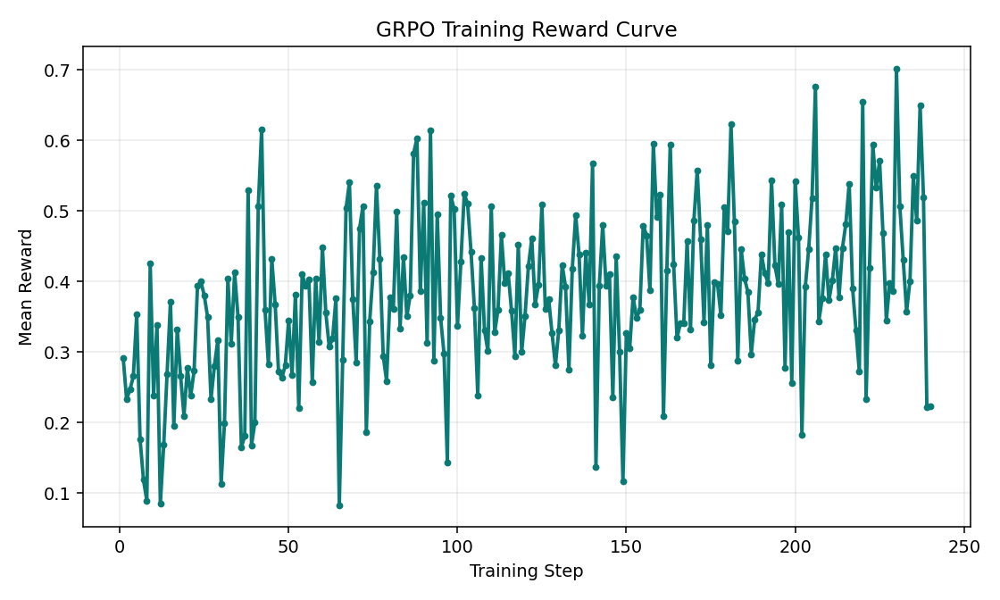
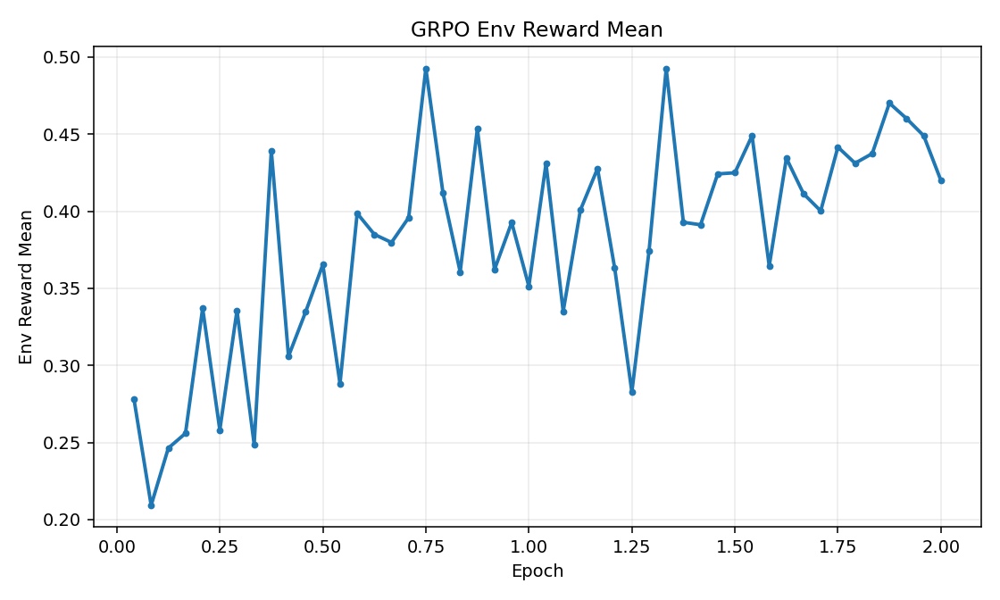
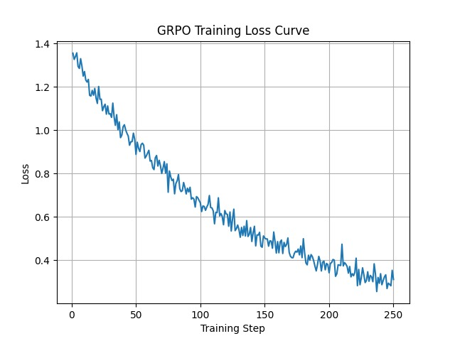
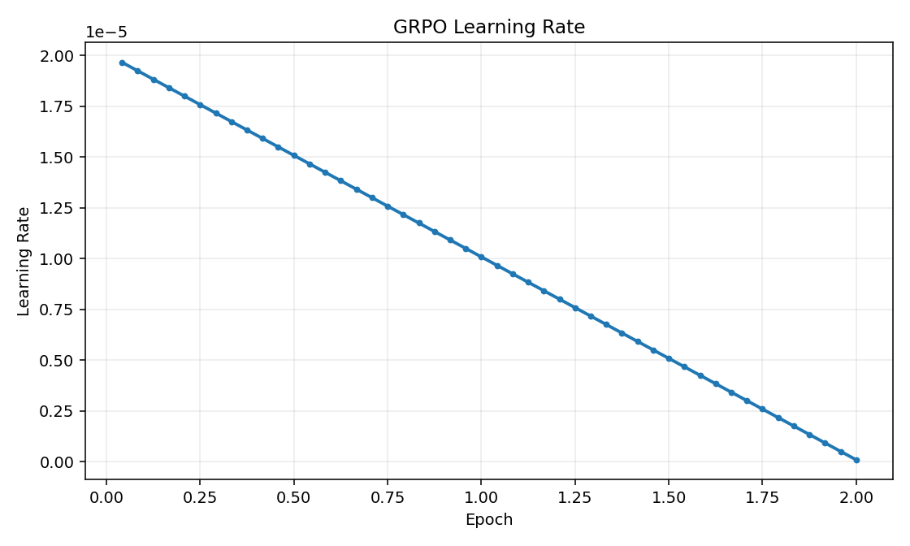
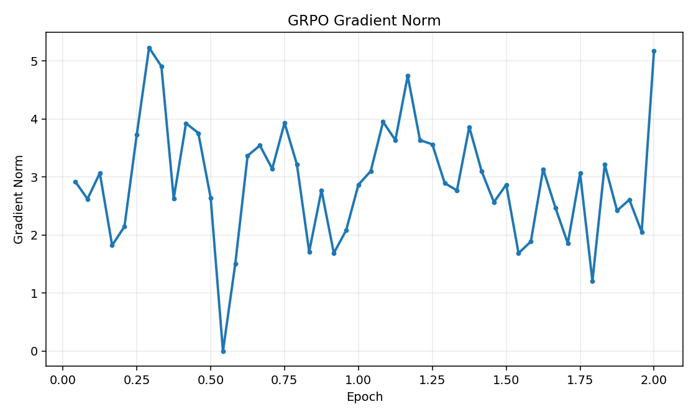

# PR Review Environment (`pr-review-env`)

Deterministic, OpenEnv-compatible reinforcement learning environment for training LLMs to perform **professional pull request triage**.

This project turns code review from a vague chat task into a **measurable decision process** with structured actions, multi-stage reasoning, and verifiable rewards.

## Quick Links

- **Training Notebook:** [GRPO_training.ipynb](https://www.kaggle.com/code/hitansh18/grpo-training)
- **Project Blog:** [Blog.md](./Blog.md)
- **Hugging Face Space:** [hitanshjain1812/meta_final](https://huggingface.co/spaces/hitanshjain1812/meta_final/main)

## 1) Problem Statement

Modern teams spend significant engineering time on PR review triage. Existing LLM assistants often produce generic summaries, but production triage requires **precise structured judgment**:

- Should this PR be `approve`, `request_changes`, or `close`?
- What labels apply (`bug`, `security`, `breaking-change`, etc.)?
- What is the right priority (`low` to `critical`)?
- Is the written summary grounded in real evidence from the diff/files?

Without deterministic evaluation, models can sound convincing while being operationally wrong.

## 2) Proposed Solution

`pr-review-env` provides an interactive environment where an agent reviews realistic PR scenarios and is scored by a deterministic reward function.

Core solution pillars:

- **100 realistic PR tasks** (30 easy, 35 medium, 35 hard)
- **3-stage review protocol** (`identify_risk`, `assess_impact`, `final_triage`)
- **Strict JSON action schema** for reproducible policy learning
- **Stage-aware multi-axis reward** with contradiction penalties and step penalty
- **Latency-adjusted scoring** for practical, fast triage behavior
- **FastAPI + OpenEnv interfaces** for easy integration with RL training loops

## 3) USP (What Makes This Project Unique)

- **Deterministic grading, not subjective judging:** No hidden LLM critic in reward computation.
- **Professional triage behavior, not just summarization:** Decision + labels + priority + evidence.
- **Stage-aware reasoning:** Reward weights shift by review stage to guide better workflow behavior.
- **Latency-aware evaluation:** High-quality but slow policies are explicitly discounted.
- **OpenEnv-native design:** Plug-in ready for environment servers and RL workflows.

## 4) Architecture



### Main Components

- **`pr_review_env/env.py`**
  - `PRReviewEnv` implementing OpenEnv `Environment`
  - Task loading, episode lifecycle, stage progression, termination logic
- **`pr_review_env/reward.py`**
  - Composite reward breakdown:
    - decision score
    - label F1 score
    - priority distance score
    - summary + evidence score
  - consistency penalties and step penalty
  - latency discount and latency-adjusted score utilities
- **`pr_review_env/models.py`**
  - Pydantic schemas for `Observation`, `Action`, `Reward`, `StepResult`
  - strict validation and allowed label constraints
- **`server/app.py`**
  - FastAPI endpoints (`/reset`, `/step`, `/state`, `/tasks`, `/validate`, `/examples`, `/metrics`, `/health`)
  - session store + TTL eviction
- **`fixtures/*.json` + `pr_review_env/tasks/*`**
  - 100 scenario fixtures with gold annotations
- **`train_grpo.py`**
  - GRPO training pipeline with LoRA, curriculum sampling, eval logging, plots

## 5) How It Works (End-to-End)

1. Client starts episode with `POST /reset` and chooses a task.
2. Environment returns an observation containing PR metadata, diff, comments, and current review stage.
3. Agent returns one structured action:

```json
{
  "decision": "approve | request_changes | close",
  "labels": ["bug", "security", "enhancement", "documentation", "breaking-change", "needs-tests", "trivial", "urgent"],
  "priority": "low | medium | high | critical",
  "review_summary": "evidence-grounded summary"
}
```

4. Environment computes reward breakdown and returns `reward`, `done`, and next observation.
5. Episode stops when either:
   - min completion condition is met (>= step 3 and high reward), or
   - max steps reached (difficulty-specific: easy 4, medium 6, hard 8).

## 6) Reward Design

Reward is clamped strictly in `(0, 1)` and combines:

- **Decision correctness**
- **Label F1**
- **Priority distance**
- **Summary quality + evidence anchoring**

Additional mechanics:

- **Stage-aware weights** (different priorities at each review stage)
- **Consistency penalty** (example: severe labels with `approve`)
- **Step penalty** (`0.02` per extra step)
- **Latency-adjusted score** via exponential discount beyond task budget

## 7) Training Pipeline (GRPO)

Training script: [`train_grpo.py`](./train_grpo.py)

Pipeline summary:

1. Build curriculum dataset from env tasks (`easy/medium/hard` sampling).
2. Prompt model with observation and strict JSON schema.
3. Validate actions with env endpoints and reward breakdown.
4. Train with `trl.GRPOTrainer` + LoRA adapters.
5. Log reward history, eval snapshots, and metric plots.

Used tooling:

- TRL (`GRPOTrainer`)
- Transformers
- PEFT (LoRA)
- Optional Unsloth path

## 8) Results and Outcomes

Training artifacts in [`training_results/`](./training_results).

### Visual Results

**Reward progression**



**Trainer environment reward**



**Training loss**



**Learning rate schedule**



**Gradient norm behavior**



### Outcome Summary

- The project establishes a **fully reproducible PR triage benchmark** for RL training.
- It supports **fine-grained diagnostics** (reward components + latency metrics).
- It is deployable as a **containerized OpenEnv service** and usable from both training and inference scripts.
- It provides a practical base for future work in multi-agent review, live repo integration, and stronger evidence oracles.

## 9) Repository Structure

```text
Meta_3_1/
|- pr_review_env/
|  |- env.py
|  |- models.py
|  |- reward.py
|  `- tasks/
|- server/
|  `- app.py
|- fixtures/
|  |- pr_easy.json
|  |- pr_medium.json
|  `- pr_hard.json
|- training_results/
|- Training Script/
|  `- GRPO_training.ipynb
|- train_grpo.py
|- inference.py
|- openenv.yaml
|- Blog.md
`- README.md
```

## 10) Run Locally

### Install

```bash
pip install -r requirements.txt
```

### Start Environment Server

```bash
uvicorn server.app:app --host 0.0.0.0 --port 7860
```

### Quick API Check

```bash
curl -X POST http://127.0.0.1:7860/reset -H "Content-Type: application/json" -d '{"task":"easy"}'
```

### Train

```bash
python train_grpo.py --env-base-url http://127.0.0.1:7860
```

### Inference

```bash
python inference.py
```

## 11) OpenEnv Compatibility

- Implements OpenEnv environment interfaces and canonical types.
- Ships with [`openenv.yaml`](./openenv.yaml) manifest.
- Supports concurrent sessions via server-side session management.

## 12) Future Roadmap

- Multi-agent reviewer debate and consensus triage
- Live GitHub PR shadow-mode evaluation
- Static-analysis assisted reward signals
- Harder long-context and multi-file dependency tasks

## 13) References

- [OpenEnv](https://github.com/meta-pytorch/OpenEnv)
- [TRL Documentation](https://huggingface.co/docs/trl)
- [Qwen Models](https://huggingface.co/Qwen)
- [LoRA Paper](https://arxiv.org/abs/2106.09685)

